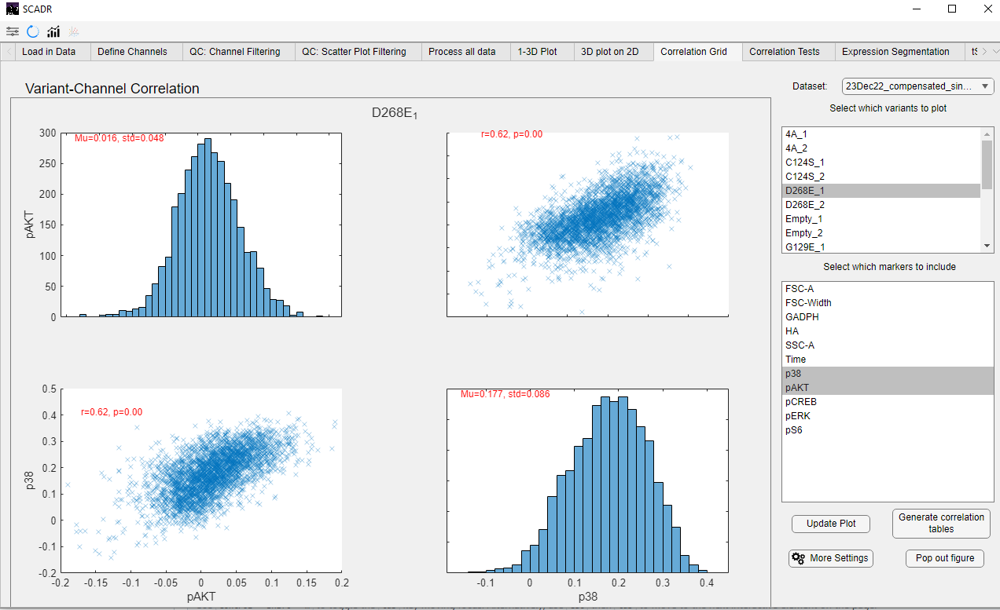

## AGNES

AGNES (Agglomerative Nesting) is a hierarchical clustering method that starts with each item as its own cluster and repeatedly merges the most similar clusters. The result is a dendrogram that shows how observations group together at different linkage distances.

## How to use AGNES in SCADR

Click the file-selection box to open a prompt and choose the Excel file to analyze with AGNES.

After the file has been imported, run AGNES to generate the hierarchical clustering plots for the unique X- and Y-axis labels.

Click "Save AGNES Results" to select an output folder. The application will save both clustering plots and an Excel workbook containing the processed data, pairwise distances, similarity scores, linkage trees, and label ordering used to generate the figures.

