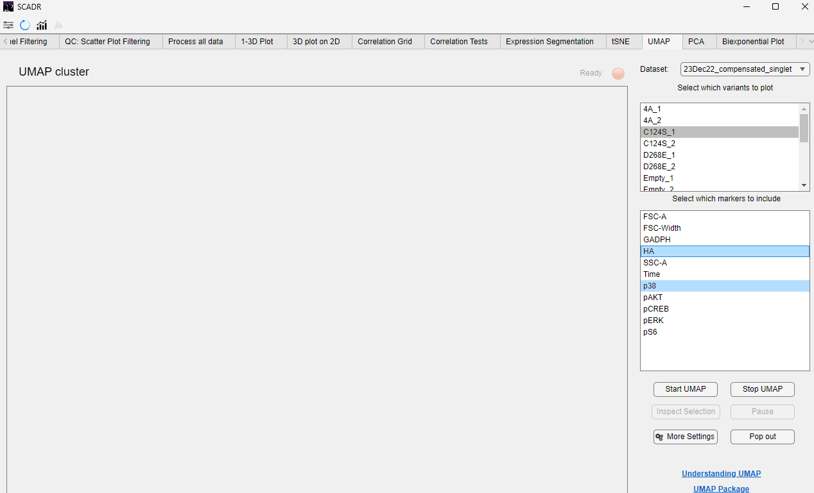

SCADR offers four primary analytical tools to help users explore complex signaling relationships within single-cell phosphoprotein data. Each method is housed under its own dedicated tab within the software. These tools enable users to uncover data structure, identify variant-specific signatures, and better understand downstream signaling behaviors.

The main analysis techniques included in SCADR are:

1. Principal Component Analysis (PCA)

2. t-distributed Stochastic Neighbor Embedding (t-SNE)

3. Uniform Manifold Approximation and Projection (UMAP)

4. Biexponential Transformation

## General User Guide
This section uses UMAP as an example, but the same procedure applies to PCA, t-SNE, and Biexponential Transformation.

1. Load your data and define markers.
   
2. Make sure the data is preprocessed and the channels are defined in the Define Channels tab.

3. Navigate to the analysis tab of your choice (e.g., UMAP, PCA, etc.).

4. Select variants and markers for analysis.

5. Use Ctrl (or Cmd on Mac) to select multiple variants or markers.

6. Click the "Start" button to execute the analysis.
The results will be displayed within the same tab, and users can interact with the plot as needed.

An example output using UMAP is shown below. All other analytical methods follow the same interactive interface and workflow.

## PCA (Principal Component Analysis)
PCA reduces high-dimensional data to a few principal components (linear combinations of your markers) that capture the most variance in the dataset. PCA is mainly used for identifying global trends and dominant signaling variations across cell populations.

## t-SNE (t-distributed Stochastic Neighbor Embedding)
t-SNE maps high-dimensional data into 2D or 3D while preserving local structure (i.e., it keeps similar cells close together). t-SNE identifies distinct signaling states, pathway-specific cell clusters, or treatment responses.

## UMAP (Uniform Manifold Approximation and Projection)
UMAP is another dimensionality reduction method that preserves both local and global structure in the data. UMAP is similar to t-SNE but often with better preservation of the overall data topology. It is useful for seeing how cell populations transition or relate to each other.

## Biexponential Transformation
Biexponential transformation rescales fluorescence data—especially useful for markers with both low and high intensity values (often used in flow cytometry). Biexponential transformation makes plots more interpretable by spreading compressed low-intensity values while compressing high-intensity outliers, enabling better visibility of all cell populations. This technique is ideal for handling skewed fluorescence distributions, especially those with negative values (common after background subtraction or compensation).

*© Copyright 2025, Jerry Tong, Corbin Glufka*
