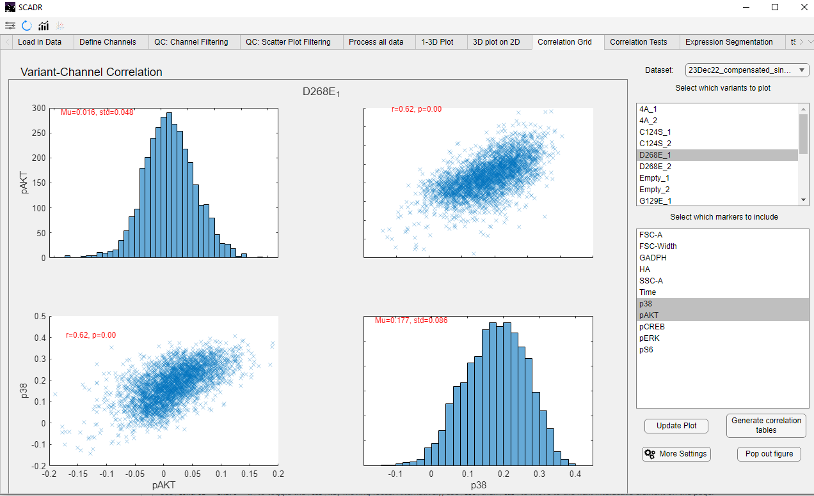

## Correlation Plots
The Correlation Grid tab allows users to evaluate the relationship between two selected markers within specific variants. It displays both distribution histograms and a correlation scatter plot, enabling users to assess expression trends and co-variation patterns. An example is shown below.

## Correlation Tests
Correlation Tests
The Correlation Test tab allows users to conduct normality and statistical tests to determine whether the expression distributions of each marker follow a normal (Gaussian) distribution. Selecting the appropriate correlation test depends on this normality assessment. The provided normality tables guide users in choosing the correct statistical tools for their data.

The available normality tests include:

Kolmogorov-Smirnov

Lilliefors

Chi-square

Anderson-Darling

Jarque-Bera

Shapiro-Wilk

D’Agostino-Pearson

If a marker fails the normality tests, non-parametric correlation methods (such as Spearman or Kendall) may be more appropriate than Pearson correlation.

An example of the output is shown below.

*© Copyright 2025, Jerry Tong, Corbin Glufka*
