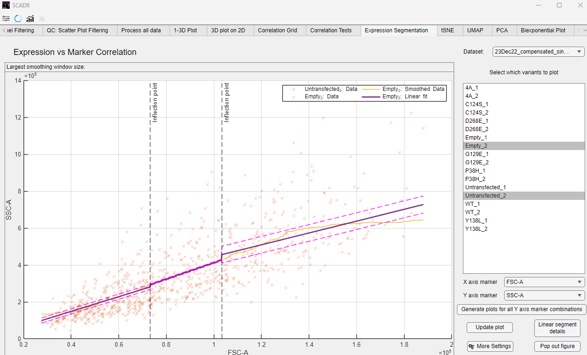

This analysis investigates how the abundance of a transfected protein (i.e., expression level) correlates with the abundance of downstream phosphoproteins (markers). It's a central function of SCADR and helps reveal the functional impact of genetic variants on signaling pathways in a dose-dependent manner.

For each single cell, SCADR tracks the expression level of the transfected protein (often tagged with a reporter like GFP). It then compares this to the intensity of downstream markers (e.g., phospho-Akt, phospho-ERK). By plotting the relationship across thousands of single cells, the software fits a dose-response curve to model how changes in expression drive downstream activity.

## Expression vs. Marker Correlation in SCADR
To perform this analysis in SCADR, navigate to the **Expression Segmentation** tab. Use the panel on the right to select the desired variant(s) and marker(s), then click **Update Plot** to generate the results.

For each selected variant-marker pair, SCADR produces a correlation plot that visualizes how the expression level of the transfected protein relates to the intensity of the downstream marker. A best-fit curve is automatically applied to highlight the overall trend.
An example output is shown below.

*© Copyright 2025, Jerry Tong, Corbin Glufka*

