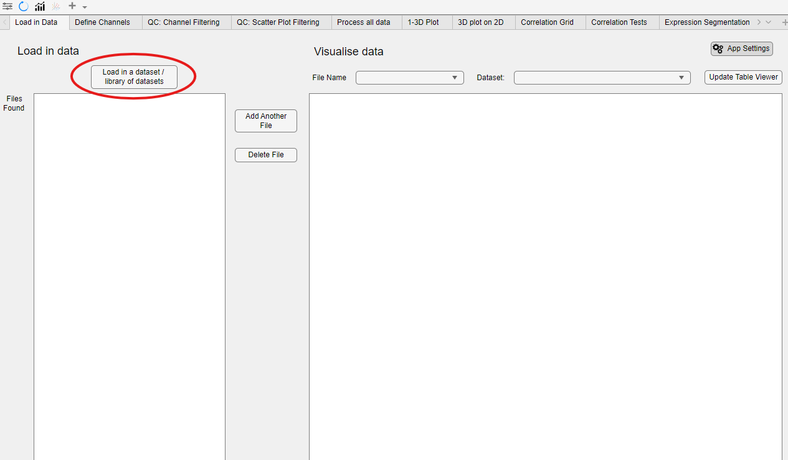
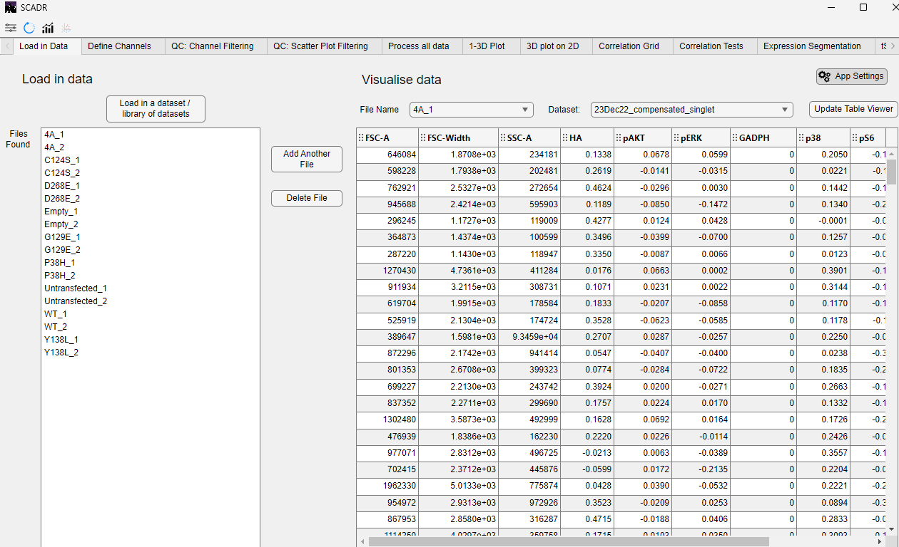

Once the software has finished setting up, the initial view will appear as shown below:

## Loading and Visualizing Data
To load data into the software, click on the **Load in a dataset / library of datasets** button, highlighted in the image above. You will first be prompted to select the location of your dataset. It is strongly recommended that the input data be stored in the input folder provided by the GitHub repository or included during installation.

Next, the software will prompt you to select a data template. An example template can be found in the “Well info file template” at the top of this GitHub repository. You may select that file during this step. If you choose to skip this step, the software will attempt to automatically detect the structure of the input files.

Once the data is loaded, you can explore it using the user interface panels on the right side of the screen.

*© Copyright 2025, Jerry Tong, Corbin Glufka*
