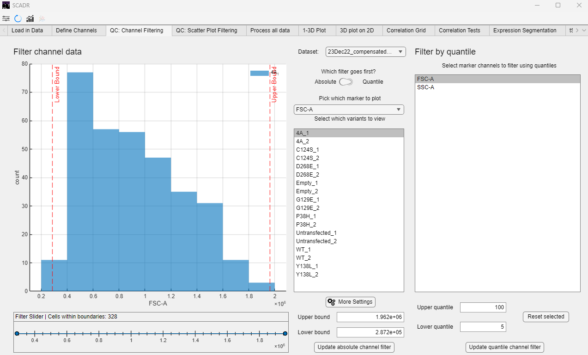
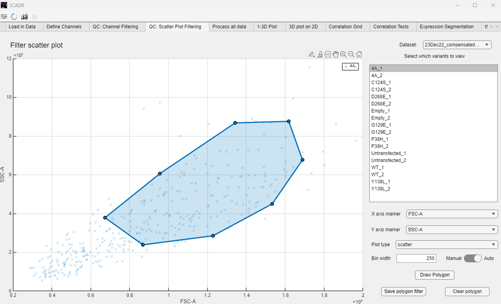

## Filtering Methods in SCADR
SCADR offers multiple filtering options to clean and preprocess data before downstream analysis. These are accessible through two dedicated tabs: one for channel-based filtering and another for scatter plot filtering.

## Channel Filtering (Under the “QC” Tab)
The Channel Filtering section provides two primary methods for excluding unwanted data points:

1. Threshold Filtering

Users can define minimum and/or maximum intensity thresholds for specific markers. This helps eliminate outliers, non-responsive cells, and background or low-signal noise.

2. Quantile-Based Filtering
   
This method removes cells falling outside a specified percentile range (e.g., below the 2nd or above the 98th percentile). It provides a flexible way to exclude extreme values without needing precise numeric cutoffs.

Below is an example of filtered data output using the methods above. The resulting figure can be saved by clicking the (invisible) button in the upper-right corner of the plot.

## Scatter Plot Filtering

The Scatter Plot Filtering tab allows users to interactively define filtering regions by manually drawing gates on 2D scatter plots. nUsers can draw polygonal gates directly on scatter plots (e.g., GFP vs. SSC-A) to isolate specific cell populations. The custom Axes Selection allows the user to select any pair of markers for the x- and y-axes, giving full flexibility in defining populations of interest based on transfection markers, signaling proteins, or scatter channels. SCADR also supports the creation of multiple gates to either include or exclude specific populations in one or more scatter plots.

Below is an example of scatter plot output. 

Filtered data from both the channel and scatter plot filtering steps are automatically used in downstream analyses, including dose-response modeling and dimensionality reduction.

*© Copyright 2025, Jerry Tong, Corbin Glufka*
